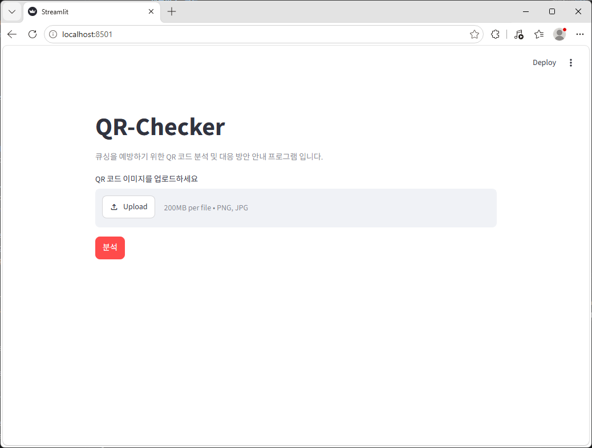
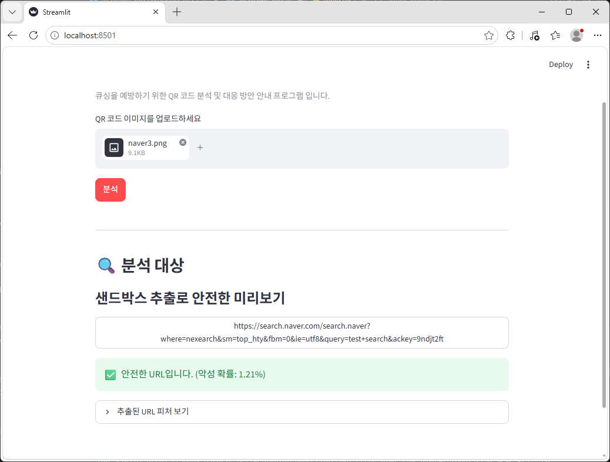
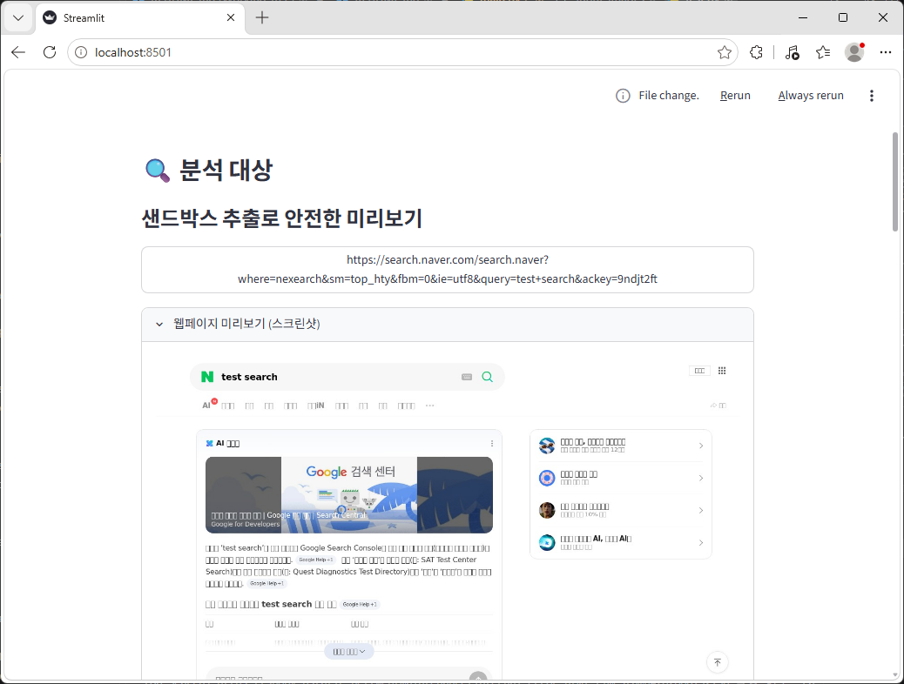
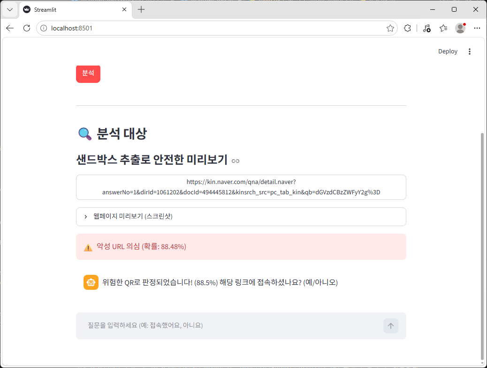
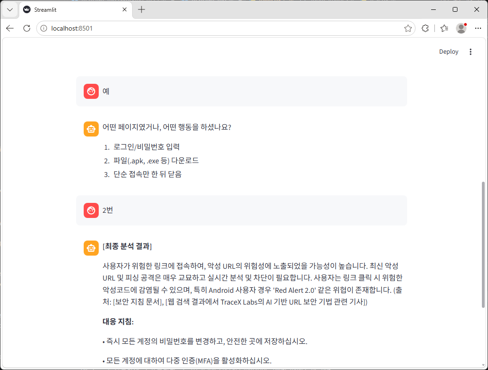

# QR-Checker
큐싱(QR Phishing)을 예방하기 위해 QR 코드 이미지를 인식하여 내부 내용 중 URL이 포함되어 있다면 URL 구조를 분석하여 악성 URL인지 검사합니다.

또한, URL을 격리된 샌드박스 환경에서 미리 열어 이미지로 캡쳐한 후 사용자에게 보여주어 큐싱을 예방할 수 있습니다.

마지막으로 악성 URL을 방문한 이력이 있다면 AI와 간단한 소통 후 대응 방안에 대해 확인할 수 있습니다.

---

### 프로젝트 원격 저장소 공유

프로젝트 원격 저장소가 생성되었습니다.

### 프로젝트 디렉토리 구조

```text
QR-Checker
├─chroma_db                 # RAG를 위한 데이터 등록 DB
├─data                      # 이미지 데이터 저장을 위한 디렉토리
│ ├─qr-image                # QR 이미지 저장
│ ├─site-image              # 웹 사이트 미리보기 이미지 저장
├─models                    # 머신러닝 모델(URL 악성 여부 확인)
├─modules                   # 여러 기능 모음 디렉토리
│ ├─AI_RAG                  # RAG 기능 모음
├─sandbox                   # 웹 사이트 미리보기 기능을 위한 격리 환경
│ ├─saved_images
```

``` bash
git clone https://github.com/akqjq1000/QR-Checker.git
```

#### 참고 사항

- **팀 별 브랜치**: 기능 개발 시 브랜치(`feature/<기능 이름>`)를 생성하여 작업 부탁 드립니다!

```bash
# 작업 예시
git pull
git checkout main
git checkout -b feature/ui
git push origin feature/ui
```

- **작업 전 git pull 필수!**
- **작업 완료 후 Pull Request 요청!**


## Installation
* docker compose 사전 설치 필수
* .env 파일 생성 후 `OPENAI_API_KEY='your_api_key` 등록
* models에 필요한 모델 세팅

#### 프로젝트 시작 세팅
```bash
git clone https://github.com/akqjq1000/QR-Checker.git
cd ./QR-Checker
pip install -r requirements.txt
```

#### 샌드박스 구동
```bash
cd QR-Checker/sandbox
# compose version 1
docker-compose up -d
# compose version 2
docker compose up -d
```

(샌드박스 초기화)

**혹시 모를 악성 코드 감염 시**
```bash
cd QR-Checker/sandbox
# 데이터 제거
# compose version 1
docker-compose down -v
# compose version 2
docker compose down -v

# compose version 1
docker-compose up -d --build
# compose version 2
docker compose up -d --build
```

> 샌드박스 구동 테스트
`curl http://localhost:8000/api`

Server is running => OK!

## 화면
```bash
cd QR-Checker
streamlit run test.py
```

1. 첫 화면


2. 이미지 업로드 후 분석 결과(정상)


3. 웹 사이트 미리보기


4. 악성 URL일 경우 분석 결과와 소통 결과

